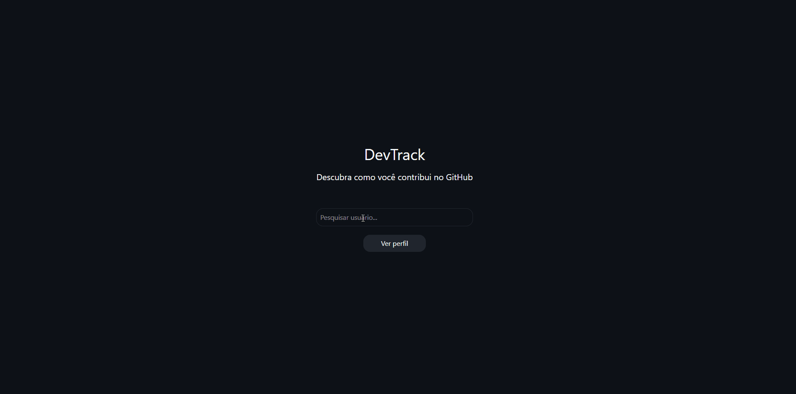

# Devtrack

Uma aplicação web que permite pesquisar seu nome e visualizar um resumo das suas estatísticas no GitHub, incluindo repositórios, commits, issues e pull requests.

Acesse o projeto: [Devtrack Live](https://dev-track-rho.vercel.app)

## Tecnologias utilizadas

- Next.js com estrutura App Router  
- React  
- JavaScript
- Tailwind CSS
- Fetch para consumo da API do GitHub com autenticação via token  
- Suspense para carregamento fluido  
- Server-Side Rendering (SSR) e Incremental Static Regeneration (ISR) com revalidate  
- Manipulação de dados com map, reduce e sort

## Funcionalidades

- Pesquisa por nome de usuário do GitHub  
- Páginas dinâmicas para exibir dados personalizados  
- Atualização periódica dos dados via revalidate  
- Cálculo e ranking de contribuições baseado em dados da API  
- Tratamento de carregamento com Suspense  
- URLs amigáveis e SEO otimizado

## 📬 Contato

Se quiser conversar, dar feedback ou propor algo, pode me encontrar por aqui:

- LinkedIn: [LinkedIn](https://www.linkedin.com/in/devgustavogomes/)
- Twitter: [Twitter](https://x.com/DevGustavo31)
- Email: devgustavogomes31@gmail.com

